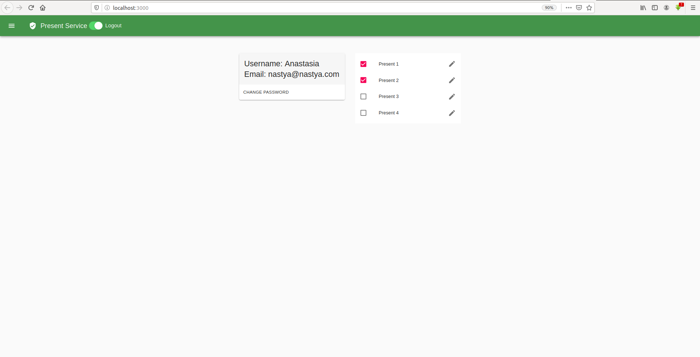
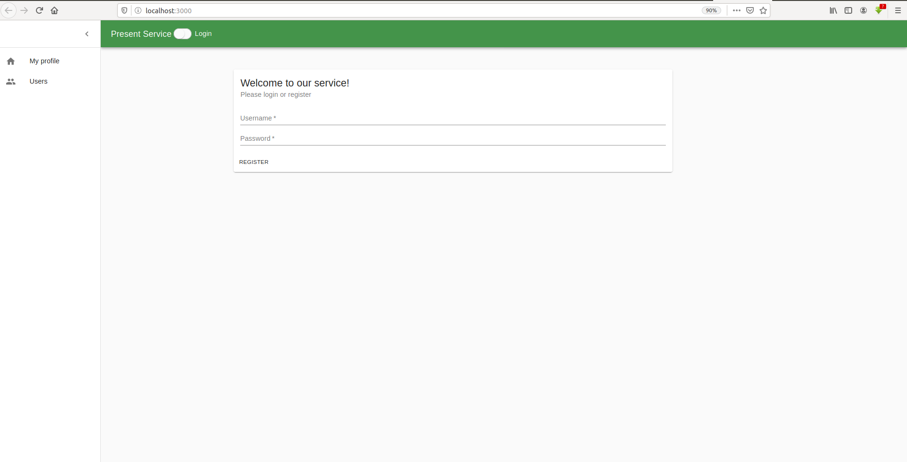

To start:
### `yarn install`
### `yarn start`

Runs the app in the development mode. 
Open [http://localhost:3000](http://localhost:3000) to view it in the browser.

User page:
 

Left menu:
 

Login - logout button: 
 
 

